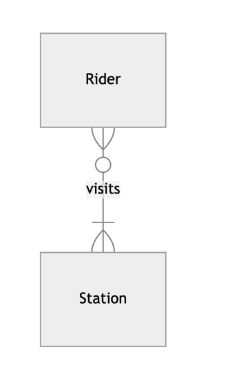
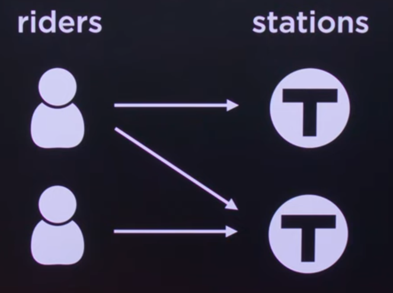

# Normalizing: 
To reduce redundancy

**Example:**

Riders
|id|name|
|--|----|
|1|Charlie|
|2|Alice|
|3|Bob|

stations
|id|locations|
|--|--------|
|1|Harvard|
|2|MIT|
|3|Park Street|

# Types of Normal Forms:
1. FIRST NORMAL FORM
2. SECOND NORMAL FORM
3. THIRD NORMAL FORM

# Relating
We now need to decide how our entities (riders and stations) are related.

**Example:**

# CREATE TABLE:
Createing a brand new table.

**Example:**
CREATE TABLE "riders" (
    "id",
    "name"
);

# Data Types and Storage Class:
Five types of Storage Class:-
1. NULL-No data
2. INTEGER- A whole numbers(from 0 to infinity)
3. REAL- decimal or floating point numbers
4. TEXT- Characters
5. BLOB- Binary Large Object
   
**Example:**

**INTEGER**
0-BYTES
1-BYTES
2-BYTES
3-BYTES
4-BYTES
6-BYTES
8-BYTES

# Type Affinities:
try to convert some values we insert into a given cell or given row to the type they have the affinity for.

